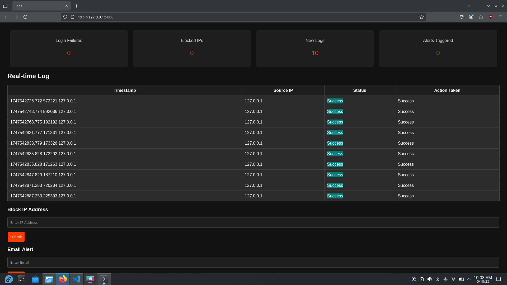

# logX
LogX is a versatile log monitor tools and manage both system logs and HTTP/HTTPS traffic logs efficiently.


# Squid Proxy Setup on Fedora for HTTP/HTTPS Activity Logging

This guide explains how to install and configure the **Squid proxy server** on a Fedora system to log web browsing activity (HTTP and HTTPS) in real time. The logs are stored in a custom directory.

## Table of Contents

- [Requirements](#requirements)
- [Installation](#installation)
- [Configuration](#configuration)
- [Set Custom Log Directory](#set-custom-log-directory)
- [Browser Proxy Configuration](#browser-proxy-configuration)
- [View Real-Time Logs](#view-real-time-logs)
- [Optional: HTTPS Interception](#optional-https-interception)
- [Troubleshooting](#troubleshooting)

---

## Requirements

- Fedora Linux system (tested on Fedora 39+)
- Root or `sudo` access
- Internet connection

---

## step 1: Installation

1. **Install Squid:**

   ```bash
   sudo dnf install squid -y

## Step 2: Enable and Start Squid


1. **Enable and Start Squid:** 

    ```bash
    sudo systemctl enable --now squid

2. **Check the Status:** 

    ```bash
    sudo systemctl status squid

## Step 3: Create a Custom Log Folder

1. **(Optional) If you want to store logs in your custom folder (e.g., /var/log/mylogs):**

    ```bash
    sudo mkdir /var/log/mylogs
    sudo chown squid:squid /var/log/mylogs

## Step 4: Configure Squid to Log to Your Folder

1. **Edit the Squid config:**

    ```bash 
    sudo nano /etc/squid/squid.conf

2. **Find the following line (or similar):**

    ```bash
    access_log /var/log/squid/access.log squid

3. **Change it to or add**

    ```bash
    access_log /var/log/mylogs/web_access.log squid

Press Ctrl + O to save, then Ctrl + X to exit
    
##  Step 5: Restart Squid
1. **Apply your config changes:**

    ```bash
    sudo systemctl restart squid


## Step 6: Configure Browser to Use the Proxy
1. **Set your browser proxy to:**

    HTTP Proxy: 127.0.0.1

    Port: 3128

    In Firefox: Settings → Network Settings → Manual Proxy Configuration

## Step 7: Verify Logging
1. Open your browser.
2. Visit some websites.
3. In the terminal, run:

    ```bash 
    sudo tail -f /var/log/mylogs/web_access.log

You'll see real-time logs of your browser activity!

## Troubleshooting
- No logs showing up?

    - Make sure your browser is using the proxy.

    - Check Squid logs:

    ```bash
     sudo journalctl -u squid

- Permission errors?

    - Ensure your log directory is owned by squid:squid

## References
 - [squid proxy site](http://www.squid-cache.org/)

 - [squid configuration manual ](http://www.squid-cache.org/Doc/config/)


    

 
